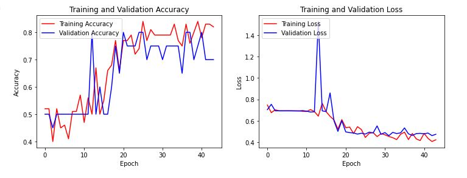
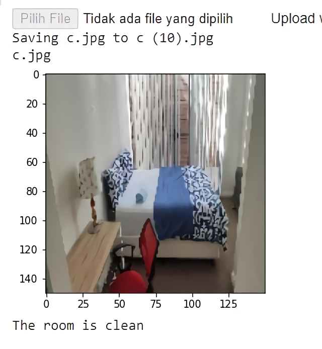

<h1 align="center"> Clean Vs Messy Rooms Classifier using Tensorflow </h1>

## Overview
In this project, the task is to classify the image of a room as clean or messy. The model architecture is built using the Convolutional Neural Network (CNN) from the Tensorflow library.

## Dataset
The data set for this project was obtained from [Kaggle](https://www.kaggle.com/cdawn1/messy-vs-clean-room). Pictures consist of two classes, clean and messy rooms. There are 192 images in the training set (96 per class); 20 images (10 per class) in the validation set; 10 images (5 per class) in the test set. The location is diverse, including bedrooms, living rooms, dining rooms, study rooms and kitchens, which might help to discourage the model from capturing unrelated features but instead focus more on the "messiness".

## Work Steps
<ol>
  <li>Import library</li>
  <li>Download and extract file</li>
  <li>Storing training and validation data sets into variables</li>
  <li>Data pre-processing using image augmentation</li>
  <li>Prepare train data</li>
  <li>Building a model architecture with CNN</li>
  <li>Plotting accuracy and loss</li>
  <li>Predict image</li>
</ol>  

## Visualize Accuracy and Loss 

## Predict Model

    

